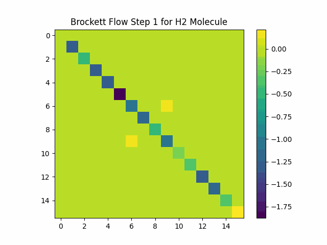
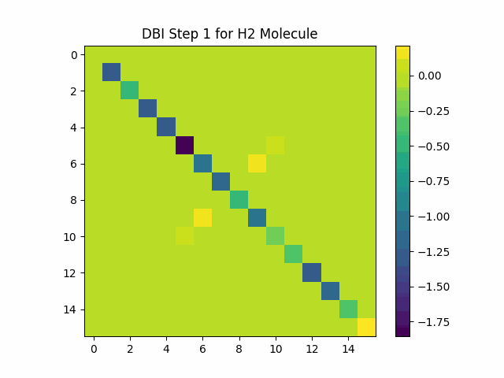

# Double-Bracket Quantum Imaginary Time Evolution (DB-QITE)

Implementation of [DB-QITE](https://doi.org/10.48550/arXiv.2412.04554) (by Gluza et al) and [Ground state by DBI](https://doi.org/10.22331/q-2024-04-09-1316) (by Gluza)

This repository implements two recently emerged algorithms for Hamiltonian ground state preparation:
* **DB-sorter**: Based on DBI algorithm sorts the eigenvalues and eigenvectors and chooses the smallest one
* **DB-QITE**: Mimics imaginary time evolution by approximating Hamiltonian commutation with `|0><0|`




## Installation
```bash
pip install db-qite
```

## Usage
### To create a `QuantumCircuit`

#### DB-sorter
```python
from db_qite import DB_Sorter

dbq = DB_Sorter(
    hamiltonian = H,         # hamiltonian: `SparsePauliOp`
    time_step = s,           # time step. list or a single value
    trotterization = True,   # whether to approx H, default True
)

circuit = dbq.create_circuit(
    num_steps,               # #iterations
)
```

#### DB-QITE
```python
from db_qite import DB_QITE

dbq = DB_QITE(
    hamiltonian = H,         # hamiltonian: `SparsePauliOp`
    initial_state = None,    # initial_state array-like, default None
    time_step = s,           # time step. list or a single value
    trotterization = True,   # whether to approx H, default True
)

circuit = dbq.create_circuit(
    num_steps,               # #iterations
    random_u0,               # boolean. U0 is random or not
)
```


### Run for a range of iterations with plots
#### DB-sorter
```python
from db_qite import db_sorter_range

runner, results = db_sorter_range(
    hamiltonian=H,
    time_step=.5,       # or a list
    num_steps_range=range(1, 3),
    backend=None, #  or "simulator" or a Qiskit Backend
    estimate_energy=True, # wether to estimate energy or just prepare the state
    shots=1024
)
```

#### DB-QITE
```python
from db_qite import db_qite_range

runner, results = db_qite_range(
    hamiltonian=H,
    initial_state=None, # or initial state
    time_step=.5,       # or a list
    random_u0=True,     # or False
    num_steps_range=range(1, 6),
    backend="simulator", #  or None to detect a qiskit backend
    estimate_energy=True, # wether to estimate energy or just prepare the state
    shots=1024
)
```

**Note:** if you provide None, or a qiskit backend name or object, it will run on IBM quantum machines. You have to set `IBM_QUANTUM_TOKEN` environment variable for it